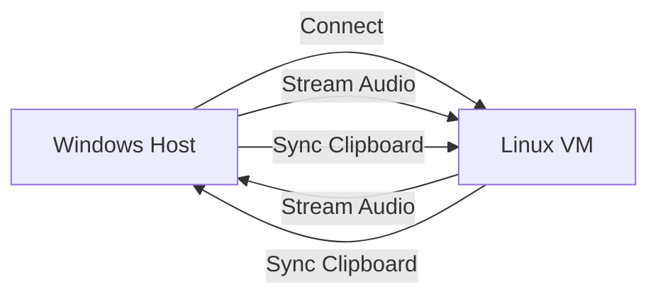

# 🔊 Hyper-V Audio & Clipboard Sync 📋

> Bridge the gap between Hyper-V and Linux with real-time audio and clipboard synchronization! 🚀

This tool provides audio and clipboard synchronization for Hyper-V Linux VMs, addressing the limitations of the built-in Enhanced Session Mode. While Hyper-V's protocol offers better performance than RDP, it lacks audio and clipboard support for Linux VMs. This solution fixes that! 🛠️

## 🌟 Features

- 🔄 Real-time clipboard synchronization (text & files)
- 🎵 Bi-directional audio streaming
- 🚀 Low latency using native Hyper-V network
- 🔒 Local network communication
- 🛡️ Works with Kali Linux and Arch Linux

## 🏗️ Architecture



## 📋 Requirements

### Windows Host
```txt
pywin32>=305
pyaudio>=0.2.11
```

### Linux VM (Arch/Kali)
```txt
pyaudio>=0.2.11
colorlog>=6.7.0  # Optional but recommended
```

## 🚀 Installation

### 🐧 Arch Linux
```bash
# Install system dependencies
sudo pacman -Syu
sudo pacman -S python python-pip git base-devel python-virtualenv xsel xclip portaudio python-pyaudio

# Clone repository
git clone https://github.com/pentestfunctions/hyper-v-audio-clipboard.git
cd hyper-v-audio-clipboard

# Create and configure virtual environment
python -m venv venv
source venv/bin/activate
pip install --upgrade pip

# Install requirements
pip install pyaudio colorlog
```

### 🔧 Kali Linux
```bash
# Install system dependencies
sudo apt update
sudo apt install -y python3 python3-pip python3-venv git build-essential portaudio19-dev python3-pyaudio xsel xclip

# Clone repository
git clone https://github.com/pentestfunctions/hyper-v-audio-clipboard.git
cd hyper-v-audio-clipboard

# Create and configure virtual environment
python3 -m venv venv
source venv/bin/activate
pip install --upgrade pip

# Install requirements
pip install pyaudio colorlog
```

### 🪟 Windows Host
```powershell
# Install Python from python.org if not already installed

# Clone repository
git clone https://github.com/pentestfunctions/hyper-v-audio-clipboard.git
cd hyper-v-audio-clipboard

# Create and configure virtual environment
python -m venv venv
.\venv\Scripts\activate
pip install --upgrade pip

# Install requirements
pip install pywin32 pyaudio
```

## 🎮 Usage

1. On Linux VM (start the server):
```bash
python stream_linux.py
```

2. On Windows Host (connect to VM):
```powershell
python windows_connect.py <VM_IP_ADDRESS>
```

## 🚀 Auto-Start on Linux Boot

Create a systemd user service for automatic startup:

```bash
mkdir -p ~/.config/systemd/user/
nano ~/.config/systemd/user/clipboard-sync.service
```

Add the following content (adjust paths):
```ini
[Unit]
Description=Hyper-V Audio & Clipboard Sync
After=network.target

[Service]
Type=simple
Environment=PATH=/home/YOUR_USERNAME/hyper-v-audio-clipboard/venv/bin:/usr/local/sbin:/usr/local/bin:/usr/sbin:/usr/bin:/sbin:/bin
WorkingDirectory=/home/YOUR_USERNAME/hyper-v-audio-clipboard
ExecStart=/home/YOUR_USERNAME/hyper-v-audio-clipboard/venv/bin/python stream_linux.py
Restart=always
RestartSec=3

[Install]
WantedBy=default.target
```

Enable and start the service:
```bash
systemctl --user daemon-reload
systemctl --user enable clipboard-sync
systemctl --user start clipboard-sync
```

## 🐛 Troubleshooting

### EXTERNALLY-MANAGED Error
If you encounter an error about Python being EXTERNALLY-MANAGED, ensure you're using a virtual environment:
```bash
which pip  # Should point to your venv directory
```

### PyAudio Installation Issues

For Arch:
```bash
sudo pacman -S base-devel
```

For Kali:
```bash
sudo apt install python3-pyaudio
```

### Testing Audio Devices
```bash
python -c "import pyaudio; p = pyaudio.PyAudio(); print([p.get_device_info_by_index(i)['name'] for i in range(p.get_device_count())])"
```

### Testing Clipboard Tools
```bash
xsel --version
xclip -version
```

## 🤝 Contributing
Feel free to submit issues and pull requests!

## ⭐ Support
If you find this helpful, please star the repository!

---
Made with ❤️ for the Hyper-V & Linux community
